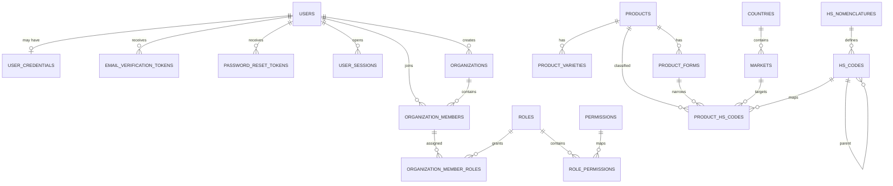

# Foundation ERD

This diagram includes only tables implemented in Foundation Phase 01.

```mermaid
erDiagram
    USERS ||--o| USER_CREDENTIALS : "may have"
    USERS ||--o{ EMAIL_VERIFICATION_TOKENS : receives
    USERS ||--o{ PASSWORD_RESET_TOKENS : receives
    USERS ||--o{ USER_SESSIONS : opens
    USERS ||--o{ ORGANIZATIONS : creates
    USERS ||--o{ ORGANIZATION_MEMBERS : joins

    ORGANIZATIONS ||--o{ ORGANIZATION_MEMBERS : contains
    ORGANIZATION_MEMBERS ||--o{ ORGANIZATION_MEMBER_ROLES : assigned
    ROLES ||--o{ ORGANIZATION_MEMBER_ROLES : grants
    ROLES ||--o{ ROLE_PERMISSIONS : contains
    PERMISSIONS ||--o{ ROLE_PERMISSIONS : maps

    COUNTRIES ||--o{ MARKETS : contains

    PRODUCTS ||--o{ PRODUCT_VARIETIES : has
    PRODUCTS ||--o{ PRODUCT_FORMS : has
    PRODUCTS ||--o{ PRODUCT_HS_CODES : classified
    PRODUCT_FORMS ||--o{ PRODUCT_HS_CODES : narrows
    MARKETS ||--o{ PRODUCT_HS_CODES : targets
    HS_NOMENCLATURES ||--o{ HS_CODES : defines
    HS_CODES ||--o{ HS_CODES : parent
    HS_CODES ||--o{ PRODUCT_HS_CODES : maps
```

