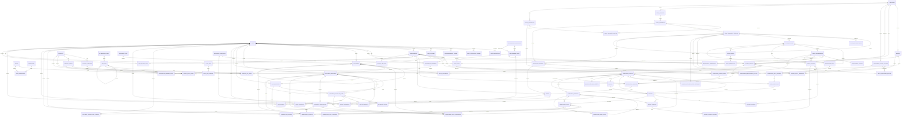

# Implemented Database ERD

This diagram includes tables implemented through Phase 10.

```mermaid
erDiagram
    USERS ||--o| USER_CREDENTIALS : "may have"
    USERS ||--o{ EMAIL_VERIFICATION_TOKENS : receives
    USERS ||--o{ PASSWORD_RESET_TOKENS : receives
    USERS ||--o{ USER_SESSIONS : opens
    USERS ||--o{ ORGANIZATIONS : creates
    USERS ||--o{ ORGANIZATION_MEMBERS : joins

    ORGANIZATIONS ||--o{ ORGANIZATION_MEMBERS : contains
    ORGANIZATION_MEMBERS ||--o{ ORGANIZATION_MEMBER_ROLES : assigned
    ROLES ||--o{ ORGANIZATION_MEMBER_ROLES : grants
    ROLES ||--o{ ROLE_PERMISSIONS : contains
    PERMISSIONS ||--o{ ROLE_PERMISSIONS : maps

    COUNTRIES ||--o{ MARKETS : contains

    PRODUCTS ||--o{ PRODUCT_VARIETIES : has
    PRODUCTS ||--o{ PRODUCT_FORMS : has
    PRODUCTS ||--o{ PRODUCT_HS_CODES : classified
    PRODUCT_FORMS ||--o{ PRODUCT_HS_CODES : narrows
    MARKETS ||--o{ PRODUCT_HS_CODES : targets
    HS_NOMENCLATURES ||--o{ HS_CODES : defines
    HS_CODES ||--o{ HS_CODES : parent
    HS_CODES ||--o{ PRODUCT_HS_CODES : maps

    ORGANIZATIONS ||--o{ EXPORT_BATCHES : owns
    USERS ||--o{ EXPORT_BATCHES : creates
    COUNTRIES ||--o{ EXPORT_BATCHES : origin
    COUNTRIES ||--o{ EXPORT_BATCHES : destination
    MARKETS ||--o{ EXPORT_BATCHES : targets
    EXPORT_BATCHES ||--o{ EXPORT_BATCH_ITEMS : contains
    PRODUCTS ||--o{ EXPORT_BATCH_ITEMS : identifies
    PRODUCT_VARIETIES ||--o{ EXPORT_BATCH_ITEMS : specifies
    PRODUCT_FORMS ||--o{ EXPORT_BATCH_ITEMS : specifies
    HS_CODES ||--o{ EXPORT_BATCH_ITEMS : classifies

    COUNTRIES ||--o{ REGISTERED_EXPORT_ENTITIES : locates
    ORGANIZATIONS ||--o{ ORGANIZATION_REGISTERED_ENTITIES : relates
    REGISTERED_EXPORT_ENTITIES ||--o{ ORGANIZATION_REGISTERED_ENTITIES : linked
    EXPORT_BATCHES ||--o{ BATCH_REGISTERED_ENTITIES : uses
    REGISTERED_EXPORT_ENTITIES ||--o{ BATCH_REGISTERED_ENTITIES : participates

    DOCUMENT_TYPES ||--o{ DOCUMENTS : classifies
    ORGANIZATIONS ||--o{ DOCUMENTS : owns
    USERS ||--o{ DOCUMENTS : creates
    DOCUMENTS ||--o{ DOCUMENTS : replaces
    DOCUMENTS ||--o{ DOCUMENT_REVISIONS : versions
    DOCUMENT_REVISIONS ||--o{ DOCUMENT_REVISIONS : follows
    DOCUMENT_REVISIONS ||--o{ DOCUMENT_FILES : contains
    USERS ||--o{ DOCUMENT_REVISIONS : creates
    USERS ||--o{ DOCUMENT_FILES : uploads
    EXPORT_BATCHES ||--o{ BATCH_DOCUMENTS : attaches
    DOCUMENTS ||--o{ BATCH_DOCUMENTS : attached
    USERS ||--o{ BATCH_DOCUMENTS : performs

    MEASUREMENT_DIMENSIONS ||--o{ MEASUREMENT_UNITS : defines
    MEASUREMENT_DIMENSIONS ||--o| MEASUREMENT_UNITS : canonicalizes
    DOCUMENT_REVISIONS ||--o{ DOCUMENT_EXTRACTION_JOBS : extracted
    DOCUMENT_FILES ||--o{ DOCUMENT_EXTRACTION_JOBS : inputs
    DOCUMENT_EXTRACTION_JOBS ||--o{ EXTRACTED_FIELDS : yields
    DOCUMENT_REVISIONS ||--o{ LAB_TEST_RESULTS : reports
    DOCUMENT_EXTRACTION_JOBS ||--o{ LAB_TEST_RESULTS : extracts
    MEASUREMENT_UNITS ||--o{ LAB_TEST_RESULTS : measures
    DOCUMENT_REVISIONS ||--o{ DOCUMENT_VERIFICATIONS : reviewed
    DOCUMENT_EXTRACTION_JOBS ||--o{ DOCUMENT_VERIFICATIONS : supports
    DOCUMENT_VERIFICATIONS ||--o{ DOCUMENT_VERIFICATION_CHANGES : records
    USERS ||--o{ DOCUMENT_VERIFICATIONS : verifies
    USERS ||--o{ DOCUMENT_VERIFICATION_CHANGES : changes

    COUNTRIES ||--o{ LEGAL_SOURCES : locates
    COUNTRIES ||--o{ LEGAL_AUTHORITIES : locates
    LEGAL_SOURCES ||--o{ LEGAL_DOCUMENTS : publishes
    LEGAL_DOCUMENTS ||--o{ LEGAL_DOCUMENT_PARTIES : involves
    LEGAL_AUTHORITIES ||--o{ LEGAL_DOCUMENT_PARTIES : participates
    LEGAL_DOCUMENTS ||--o{ LEGAL_DOCUMENT_VERSIONS : versions
    LEGAL_DOCUMENT_VERSIONS ||--o{ LEGAL_DOCUMENT_VERSIONS : follows
    LEGAL_DOCUMENT_VERSIONS ||--o{ LEGAL_DOCUMENT_FILES : evidences
    LEGAL_DOCUMENT_VERSIONS ||--o{ LEGAL_SECTIONS : structures
    LEGAL_SECTIONS ||--o{ LEGAL_SECTIONS : contains
    LEGAL_SECTIONS ||--o{ LEGAL_REQUIREMENTS : establishes
    LEGAL_REQUIREMENTS ||--o{ REQUIREMENT_SCOPES : scopes
    LEGAL_REQUIREMENTS ||--o{ REQUIREMENT_PARAMETERS : parameterizes
    LEGAL_REQUIREMENTS ||--o{ LEGAL_LIMITS : establishes
    REGULATED_SUBSTANCES ||--o{ LEGAL_LIMITS : limits
    REGULATED_SUBSTANCES ||--o{ LAB_TEST_RESULTS : maps
    MEASUREMENT_UNITS ||--o{ REQUIREMENT_PARAMETERS : measures
    MEASUREMENT_UNITS ||--o{ LEGAL_LIMITS : measures
    LEGAL_SECTIONS ||--o{ LEGAL_CITATIONS : cites
    LEGAL_SECTIONS ||--o{ LEGAL_CHUNKS : chunks
    LEGAL_CHUNKS ||--o{ LEGAL_EMBEDDINGS : embeds
    LEGAL_REQUIREMENTS ||--o{ LEGAL_CITATIONS : supports
    REGISTERED_EXPORT_ENTITIES ||--o{ MARKET_ENTITY_APPROVALS : receives
    MARKETS ||--o{ MARKET_ENTITY_APPROVALS : applies
    LEGAL_AUTHORITIES ||--o{ MARKET_ENTITY_APPROVALS : grants
    LEGAL_DOCUMENT_VERSIONS ||--o{ MARKET_ENTITY_APPROVALS : authorizes
    LEGAL_CITATIONS ||--o{ MARKET_ENTITY_APPROVALS : proves

    LEGAL_REQUIREMENTS ||--o{ COMPLIANCE_RULES : implements
    COMPLIANCE_RULES ||--o{ COMPLIANCE_RULE_VERSIONS : versions
    LEGAL_DOCUMENT_VERSIONS ||--o{ COMPLIANCE_RULE_VERSIONS : grounds
    ORGANIZATIONS ||--o{ COMPLIANCE_CHECKS : owns
    EXPORT_BATCHES ||--o{ COMPLIANCE_CHECKS : checks
    COMPLIANCE_CHECKS ||--o{ COMPLIANCE_CHECKS : rechecks
    COMPLIANCE_CHECKS ||--o{ COMPLIANCE_CHECK_DOCUMENTS : snapshots
    DOCUMENTS ||--o{ COMPLIANCE_CHECK_DOCUMENTS : identifies
    DOCUMENT_REVISIONS ||--o{ COMPLIANCE_CHECK_DOCUMENTS : freezes
    DOCUMENT_FILES ||--o{ COMPLIANCE_CHECK_DOCUMENTS : proves
    DOCUMENT_VERIFICATIONS ||--o{ COMPLIANCE_CHECK_DOCUMENTS : verifies
    DOCUMENT_EXTRACTION_JOBS ||--o{ COMPLIANCE_CHECK_DOCUMENTS : extracts
    COMPLIANCE_CHECKS ||--o{ COMPLIANCE_CHECK_LEGAL_VERSIONS : snapshots
    LEGAL_DOCUMENT_VERSIONS ||--o{ COMPLIANCE_CHECK_LEGAL_VERSIONS : freezes
    COMPLIANCE_CHECKS ||--o{ RULE_EXECUTIONS : executes
    COMPLIANCE_RULE_VERSIONS ||--o{ RULE_EXECUTIONS : runs
    RULE_EXECUTIONS ||--o{ FINDINGS : surfaces
    COMPLIANCE_CHECKS ||--o{ FINDINGS : contains
    COMPLIANCE_CHECKS ||--o{ AI_RUNS : analyzes
    AI_RUNS ||--o{ FINDINGS : produces
    FINDINGS ||--o{ FINDING_CITATIONS : cites
    LEGAL_CITATIONS ||--o{ FINDING_CITATIONS : supports
    COMPLIANCE_CHECKS ||--o{ COMPLIANCE_CHECK_EVENTS : records
    COMPLIANCE_CHECKS ||--o| COMPLIANCE_REPORTS : generates
    COMPLIANCE_REPORTS ||--o| COMPLIANCE_REPORTS : follows
    COMPLIANCE_REPORTS ||--o{ REPORT_FINDINGS : snapshots
    FINDINGS ||--o{ REPORT_FINDINGS : sourced
    REPORT_FINDINGS ||--o{ REPORT_FINDING_CITATIONS : cites
    LEGAL_CITATIONS ||--o{ REPORT_FINDING_CITATIONS : snapshots
    COMPLIANCE_REPORTS ||--o{ REPORT_APPROVALS : reviewed
    USERS ||--o{ REPORT_APPROVALS : decides

    COMPLIANCE_REPORTS ||--o{ REMEDIATION_TASKS : requires
    FINDINGS ||--o{ REMEDIATION_TASKS : remediates
    REMEDIATION_TASKS ||--o{ REMEDIATION_TASK_ASSIGNEES : assigned
    USERS ||--o{ REMEDIATION_TASK_ASSIGNEES : receives
    REMEDIATION_TASKS ||--o{ REMEDIATION_EVIDENCE : evidenced
    DOCUMENTS ||--o{ REMEDIATION_EVIDENCE : identifies
    DOCUMENT_REVISIONS ||--o{ REMEDIATION_EVIDENCE : freezes
    DOCUMENT_VERIFICATIONS ||--o{ REMEDIATION_EVIDENCE : verifies
    REMEDIATION_TASKS ||--o{ REMEDIATION_REVIEWS : reviewed
    USERS ||--o{ REMEDIATION_REVIEWS : decides
    REMEDIATION_TASKS ||--o{ REMEDIATION_TASK_EVENTS : records

    LEGAL_DOCUMENTS ||--o{ REGULATION_CHANGES : changes
    LEGAL_DOCUMENT_VERSIONS ||--o{ REGULATION_CHANGES : compares
    REGULATION_CHANGES ||--o{ REGULATION_CHANGE_ITEMS : contains
    LEGAL_REQUIREMENTS ||--o{ REGULATION_CHANGE_ITEMS : references
    LEGAL_LIMITS ||--o{ REGULATION_CHANGE_ITEMS : references
    ORGANIZATIONS ||--o{ BATCH_LEGAL_IMPACTS : owns
    EXPORT_BATCHES ||--o{ BATCH_LEGAL_IMPACTS : assessed
    REGULATION_CHANGE_ITEMS ||--o{ BATCH_LEGAL_IMPACTS : impacts
    COMPLIANCE_CHECKS ||--o{ BATCH_LEGAL_IMPACTS : contextualizes
    ORGANIZATIONS ||--o{ ALERTS : owns
    BATCH_LEGAL_IMPACTS ||--o| ALERTS : raises
    REGULATION_CHANGES ||--o{ ALERTS : explains
    ALERTS ||--o{ ALERT_RECIPIENTS : targets
    USERS ||--o{ ALERT_RECIPIENTS : receives
    ALERTS ||--o{ NOTIFICATIONS : delivers
    USERS ||--o{ NOTIFICATIONS : receives

    ORGANIZATIONS ||--o{ AUDIT_LOGS : scopes
    USERS ||--o{ AUDIT_LOGS : acts
    AUDIT_LOGS ||--o{ AUDIT_LOG_CHANGES : details
    ORGANIZATIONS ||--o{ DATA_ACCESS_LOGS : scopes
    USERS ||--o{ DATA_ACCESS_LOGS : accesses
    ORGANIZATIONS ||--o{ SYSTEM_JOB_RUNS : scopes
```
